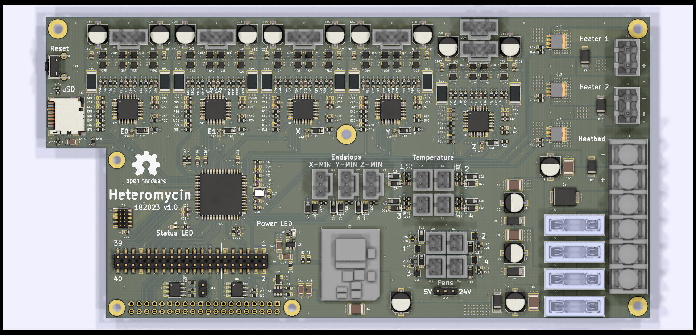

# Heteromycin - 3D printer board

[Join us on Discord!](https://discord.gg/f4dmGsn)

Heteromycin is a 3D printer controller that aims to provide a full stack user
experience around Octoprint / Marlin using a custom designed board that
integrates a Raspberry Pi 3 or Zero W. It will also provide a solid, powerfull
hardware by utilizing quality components, a STM32 32bit MCU and powerfull
TMC5160 or TMC2160 driver (SD / SPI mode).

## Features

* 32bit STM32H743VI 400Mhz / 1024KiB RAM / 2MiB Flash MCU / 4 KiB EEPROM
* Integrated Raspberry Pi 3 / Zero W HAT connector as the main user interface
* Integrated DC/DC switching module for 5V / 3.3V power supply
* 5x TMC5160 or TMC2160 stepper driver with 8x external Power MOSFET each
* 3x high power MOSFET for heating (2x heater, 1x heatbed, 24V)
* 4x low power MOSFET for fans (5V or 24V)
* 40 pin external connector for STM32 and Pi GPIO pins
  * GPIO
  * PWM
  * UART
  * SPI
  * I2C
  * 3.3V / 5V / GND for external power consumption
* Micro SD Card for storing GCODE files (directa MCU access)
* Designed for a 24V power supply
* Automotive fuses
* Quality connectors
* Octoprint plugin for flashing the firmware of the board (STM32)

## Roadmap

* Hardware
  * [x] Describe the general functionality and select the main components
  * [x] Draw the schematics of the PCB
  * [x] Placement & routing of the PCB
  * [ ] Production of a development board
  * [ ] Testing the PCB
  * [ ] Repreat until hardware is finished
* Software
  * [x] Write arduino core board definition once first PCB design is finished
  * [ ] Write PIN file for Marlin
  * [ ] Test board (esp. the TMC*160 driver)
  * [ ] Octoprint plugin for firmware upgrade
  * [ ] STM32flash rewrite (fix I2C and add SPI, maybe rewrite in rust)
  * [ ] Create a script / image with Octoprint with the plugin / tools
  preinstalled
  * [ ] Documentation

## Alternative Parts

### Stepper driver

You can use both TMC5160 or TMC2160 as the stepper driver, since they both are
functionally / pin equal when used in SD / SPI-Mode.

It doesn't mater choosing one over the other, other than price and availability.

Fine tuning of the MOSFET driver may be necessary.

## License

The hardware is licensed under CERN OHL version 1.2.
The software is licensed under GNU GPL v3.

The files under PCB/packages3d are excluded from this license and are provided
under fair use terms for this open-source project.
